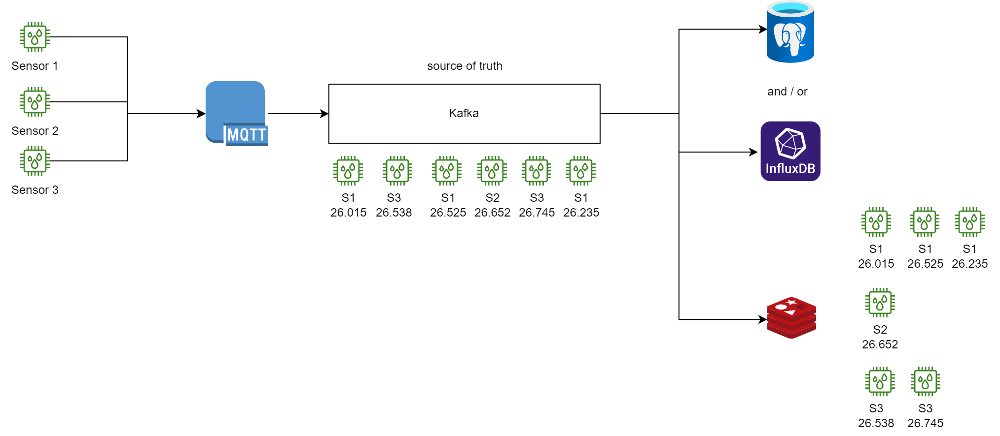
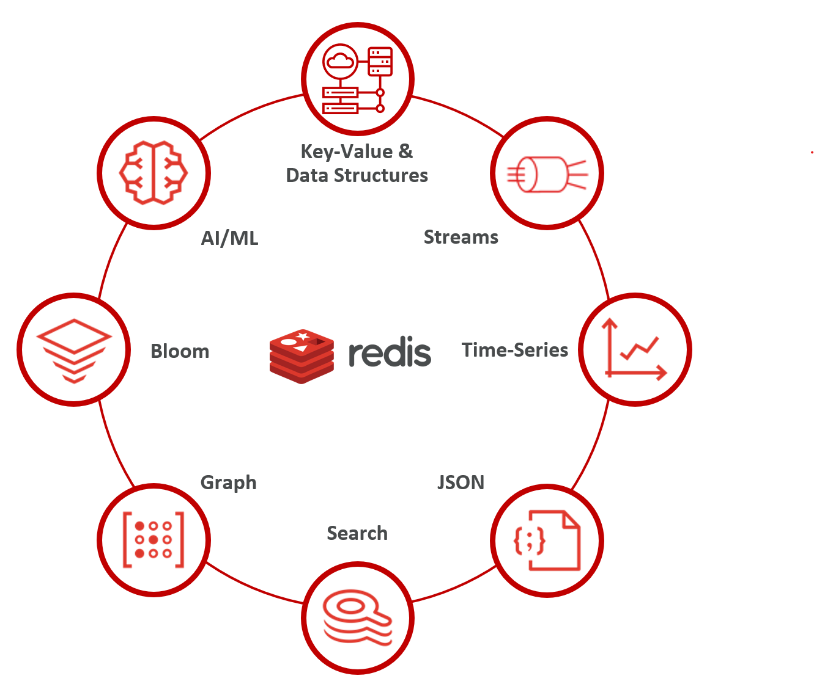
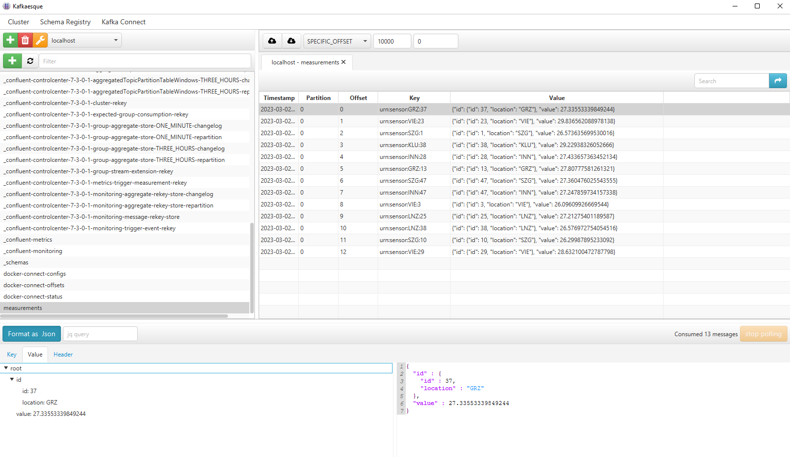
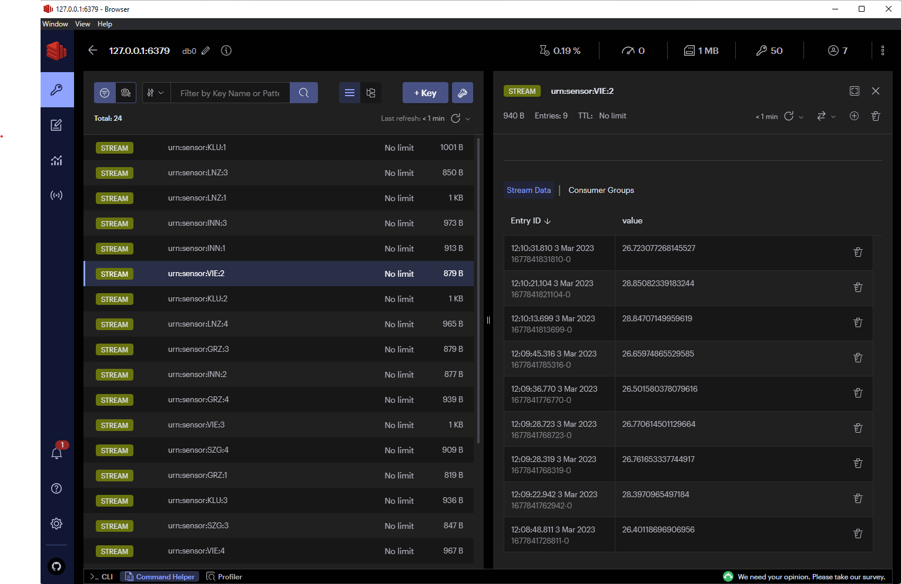

# General goal
Kafka is used as source of truth it lots of projects - especially when the project is modeled around events. In lots of situations other technologies are needed to make the post-processing / allowing for queries / ... easier. PostgreSQL for example can be used to make analytical queries. PostgreSQL can also act as a time series database (using the BRIN index and for in some situation also a B-Tree - influxDB may use less memory - but anyhow).

Problem description: Creating dynamic topics on the fly in Kafka is possible (see [auto.create.topics.enable](https://docs.confluent.io/platform/current/installation/configuration/broker-configs.html#auto.create.topics.enable)). With the new RAFT implementation used in this demo (see docker-compose.yml) millions of topics are possible (see [docu](https://www.confluent.io/blog/kafka-without-zookeeper-a-sneak-peek/)). 

So why use Redis at all?

Reason 1: Redis supports several data structures (e.g. JSON, Streams, Arrays, String, ...). Beside that, Redis has the Redis stack (see https://redis.io/docs/stack/).

The point is: We are talking all the about polyglot persistence. But the reality is: Yes, since container technologies got more and more popular, its easy to make

    $ docker run --name some-postgres -e POSTGRES_PASSWORD=mysecretpassword -d postgres

But:

* What about backups?
* What about support if its stops working as expected?
* What about availability? How to setup replication?
* How can the team gain knowledge for this technology?
* What about security? Is it easier to handle 2 or 10 products?

So, at the end of the day I'm quite happy, if I see, that products like PostgreSQL or Redis support the most common scenarios and I can reuse my knowledge and don't have to handle 10 isolated products in my project, if there is no good reason for it.

Reason 2: As I mentioned above, it's possible to create lots of topics in Kafka nowadays. But depending on the use-cases, you may design the Kafka topology for measurements as a single topic and publish all measurements there (assume you make topic:sensor as 1:1 - it will get hard for PostgreSQL to consume all that topics). So, having one Kafka topic and split up in several Redis streams (use Redis a stream) should be a valid use-case - at least in my opinion ;-)

# Generating random data
This can be done using the [Kafka Datagen Connector](https://github.com/confluentinc/kafka-connect-datagen). This connector uses the [Avro Random Generator Format](https://github.com/confluentinc/avro-random-generator). A quickstart guide can be found [here](https://www.confluent.io/blog/easy-ways-generate-test-data-kafka/).

In our example we want to produce temperature values from Austrian airports. This looks like: <<GITHUB>>

If you are using WSL2, install following tools:

    apt install httpie jq

To get an minified JSON string of our schema do:
  
    jq -c . measurement.avsc | jq -R

## Generating a key
If you have lots of GUIDs flying around, there will be the time, were you get an id (for example if somebody asks you for analysis) and you don't know which one it is. For this reason using [URN](https://de.wikipedia.org/wiki/Uniform_Resource_Name) is always a good practice in huge environment:

    urn:sensor:VIE:4

This can't be done with the [standard transformations in confluent](https://docs.confluent.io/platform/current/connect/transforms/overview.html). So, i had to write a custom SMT. As a starting point, its always good to look at the [existing once](
https://github.com/apache/kafka/tree/trunk/connect/transforms/src/main/java/org/apache/kafka/connect/transforms/). The implementation can be found here <<GITHUB>>

## Start the generation
Now we can configure the connector:
    
    http POST http://localhost:8083/connectors @datagen_post.json

In a browser we can verify, if the connector is running: http://localhost:8083/connectors/datagen-measurements/status.

Using [KafkaEsque](https://kafka.esque.at/) allows you to consume the topic easily (don't forget to select "AVRO" for the message type). You should see something like:

# Bringing data from Kafka to Redis
There is already and [Sink-Connector from Confluent](https://docs.confluent.io/kafka-connectors/redis/current/overview.html). The source code can be found at github: [Redis Sink Connector](https://github.com/jcustenborder/kafka-connect-redis). The problem with this connector is, that it only allows the [SET operation](https://redis.io/commands/set/). So, only the last value of each sensor would be available - if needed - fine. But we want the whole history.

Another possibly is to use [lenses.io](https://lenses.io/). It's build around Kafka and Confluent and can be found [here](https://github.com/lensesio/stream-reactor). It also has a [Redis connector](https://github.com/lensesio/stream-reactor/tree/master/kafka-connect-redis) which supports streams. It uses a [KCQL](https://docs.lenses.io/5.0/integrations/connectors/stream-reactor/sinks/redissinkconnector/). To be honest - I was not able to build the scala project and I was not happy, that the project is quite huge - even I just need a small part of it.

So lets write a small connector and try it out. A simple connector can be found [here](https://github.com/apache/kafka/tree/3.3/connect/file/src/main/java/org/apache/kafka/connect/file).

The connector can be configured via

    http POST http://localhost:8083/connectors @redis_post.json

After that, http://localhost:8083/connectors/kafka-connect-redis/status should show a running task and Redis should contain the values:

